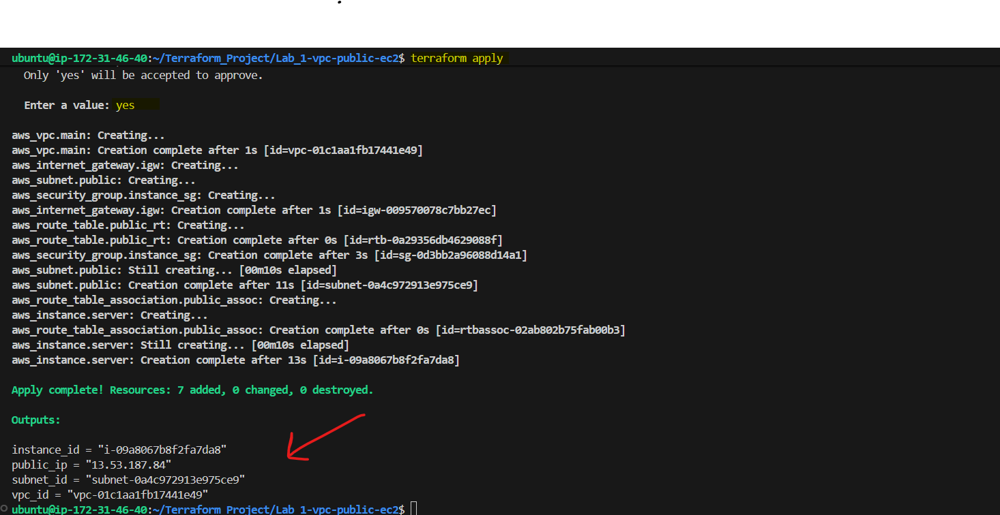
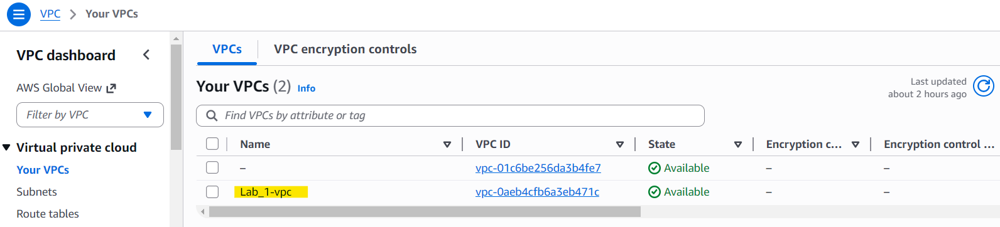
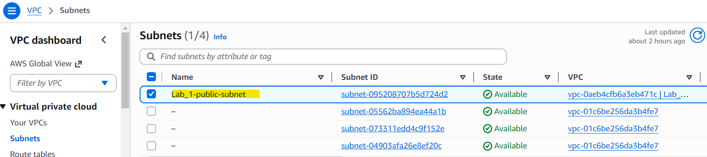
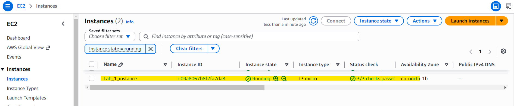
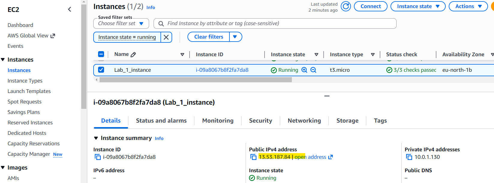
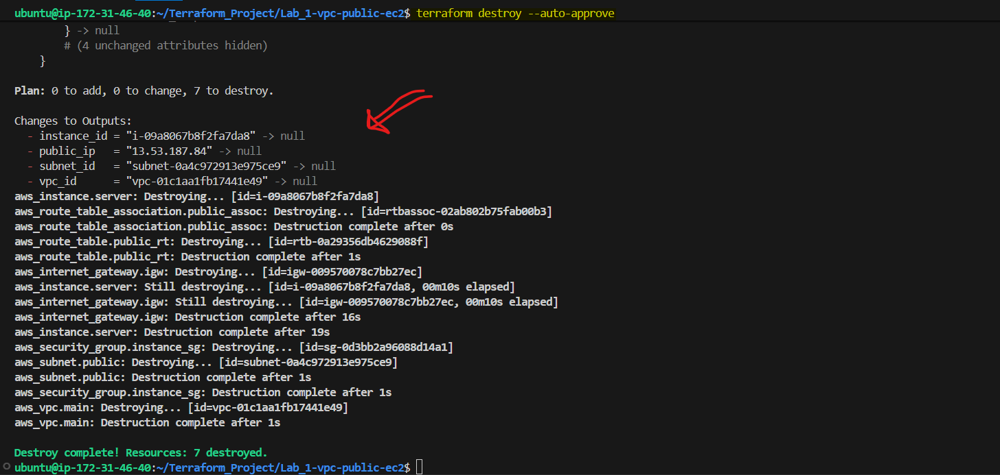

# Lab-01: AWS Infrastructure Provisioning with Terraform
1. Create an IAM user that has programmatic access with the appropertiate permissions to create EC2 instances, VPCs, and subnets. Use this user to do the below      tasks.
2. Create a new VPC and a new public subnet, use any supported CIDR blocks.
3. Create an EC2 instance of t3.micro type and assign a tag to it as follows name= "Lab-01_instance", ensue the instance will be assigned a public IP.
4. Ensure the EC2 instance is created inside the newly created VPC public subnet above.
5. Finally destroy the terraform deployed infrastructure.
---
## Objectives
The objectives of this lab are:
1. Create a new AWS VPC.
2. Create a Public Subnet inside the VPC.
3. Configure Internet connectivity.
4. Launch an EC2 instance of type `t3.micro`.
5. Assign the tag:

```text
Name = Lab-01_instance
```
6. Ensure the instance receives a Public IP address.
7. Deploy all resources using Terraform.
8. Destroy all deployed resources using Terraform.
---
## Architecture Diagram

```text
                    Internet
                        │
                        ▼
              +------------------+
              | Internet Gateway |
              +------------------+
                        │
                        ▼
              +------------------+
              |      VPC         |
              | 10.0.0.0/16      |
              +------------------+
                        │
                        ▼
              +------------------+
              |  Public Subnet   |
              | 10.0.1.0/24      |
              +------------------+
                        │
                        ▼
              +------------------+
              |   EC2 Instance   |
              |   t3.micro       |
              +------------------+
                        │
                        ▼
                  Public IP
```

---

## Technologies Used

- Terraform
- AWS EC2
- AWS VPC
- AWS Internet Gateway
- AWS Route Tables
- AWS Security Groups

---

## Project Structure

```text
lab-01/
│
├── provider.tf
├── variables.tf
├── main.tf
├── outputs.tf
├── terraform.tfvars
└── README.md
```

---

## Terraform Resources

### VPC

Creates a custom VPC using the CIDR block:

```text
10.0.0.0/16
```

### Public Subnet

Creates a subnet with:

```text
10.0.1.0/24
```

and enables automatic public IP assignment.

### Internet Gateway

Provides internet access to resources inside the VPC.

### Route Table

Adds a default route:

```text
0.0.0.0/0
```

to the Internet Gateway.

### Security Group

Allows:
- SSH (Port 22)

Outbound traffic is fully allowed.

### EC2 Instance

Configuration:

| Property | Value |
|-----------|--------|
| Type | t2.micro |
| OS | Amazon Linux 2023 AMI |
| Public IP | Enabled |
| Name Tag | Lab-01_instance |

---

## Deployment Steps

### Initialize Terraform

```bash
terraform init
```

### Validate Configuration

```bash
terraform validate
```

### Review Execution Plan

```bash
terraform plan
```

### Deploy Infrastructure

```bash
terraform apply
```

Type:

```text
yes
```

when prompted.

---

## Verify Deployment

```text
screenshots/terraform-apply-success.png
```


---

## AWS Console Verification

### VPC Created

```text
screenshots/vpc-created.png
```



---

### Public Subnet Created
```text
screenshots/public-subnet.png
```



---

### EC2 Instance Created

- Instance Name: Lab-01_instance
- Instance State: Running

```text
screenshots/ec2-instance.png
```



---

### Public IP Verification
```text
screenshots/public-ip.png
```



---

## Destroy Infrastructure

After verification:

```bash
terraform destroy
```

Type:

```text
yes
```

when prompted.

---

## Terraform Destroy Success

```text
screenshots/terraform-destroy-success.png
```



---

## Learning Outcomes

By completing this lab, I learned how to:

- Use Terraform to automate AWS resource creation.
- Create and manage VPC networking components.
- Launch EC2 instances using Infrastructure as Code.
- Configure internet access through Internet Gateways and Route Tables.
- Assign Public IP addresses to EC2 instances.
- Manage infrastructure lifecycle using:
  - terraform init
  - terraform plan
  - terraform apply
  - terraform destroy

---

## Author
GitHub: Assem-Alasri
